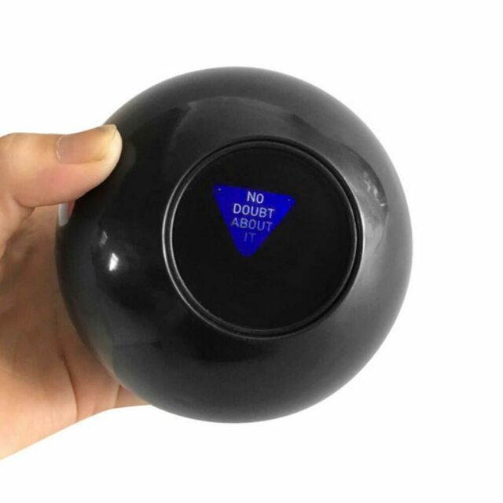

# Desafio 8 - A Bola mágica 8 :8ball:

Talvez você não conheça, porém existe um brinquedo que foi muito famoso na década de 50 chamado **Magic 8 Ball** que era basicamente um brinquedo em formato de uma bola 8 de sinuca que ao fazer uma pergunta simples de respostas "SIM" ou "NÃO", ela responderia a chance disso acontecer.

Dentre essas chances haviam 20 possíveis respostas:

10 possíveis respostas afirmativas:

- É Certo (It is Certain)
- É Decidido (It is decidedly so)
- Sem dúvidas (Without a doubt)
- Sim, definitivamente (Yes - definitely)
- Você pode contar com (You may rely on it)
- Eu vejo como um sim (As I see it, yes)
- Provavelmente (Most likely)
- Boa perspectiva (Outlook good)
- Sim (Yes)
- Sinais apontam que sim (Signs point to yes)

5 possíveis respostas sem compromisso:

- Não entendi, tente novamente (Reply hazy, try again)
- Tente novamente mais tarde (Try again later)
- Melhor não te falar agora (Better not tell you now)
- Não consigo prever agora (Cannot predict now)
- Concentre-se e pergunte novamente (Concentrate and ask again)

5 possíveis respostas negativas:

- Não contaria com isso (Don't count on it)
- Minha resposta é não (My reply is no)
- Minhas fontes dizem que não (My sources say no)
- Perspectivas não tão boas (Outlook not so good)
- Bem duvidoso (Very doubtful)

## Premissas

- Crie uma função que retorne uma das respostas quando chamada

### OBS

- Possivelmente iremos utilizar essa função em um challange de html
